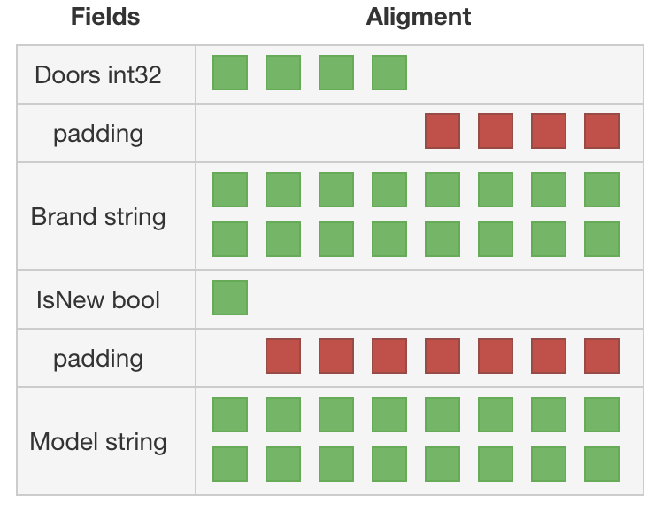
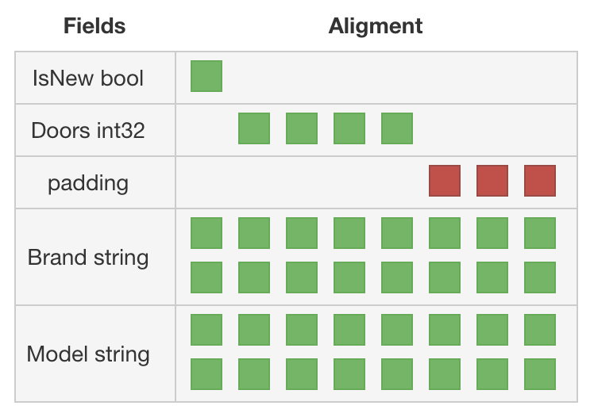

# Better word alignment in Go struct

In this example we see

* an example of word misalignment (`CarA`)

	

* and one of better word alignment (`CarB`)

	

---

## Links

* https://medium.com/@sebassegros/golang-dealing-with-maligned-structs-9b77bacf4b97

### Additionals

* https://dave.cheney.net/2015/10/09/padding-is-hard
* https://golang.org/src/go/types/sizes.go
* https://stackoverflow.com/questions/39063530/optimising-datastructure-word-alignment-padding-in-golang
* http://golang-sizeof.tips/
* https://en.wikipedia.org/wiki/Data_structure_alignment
